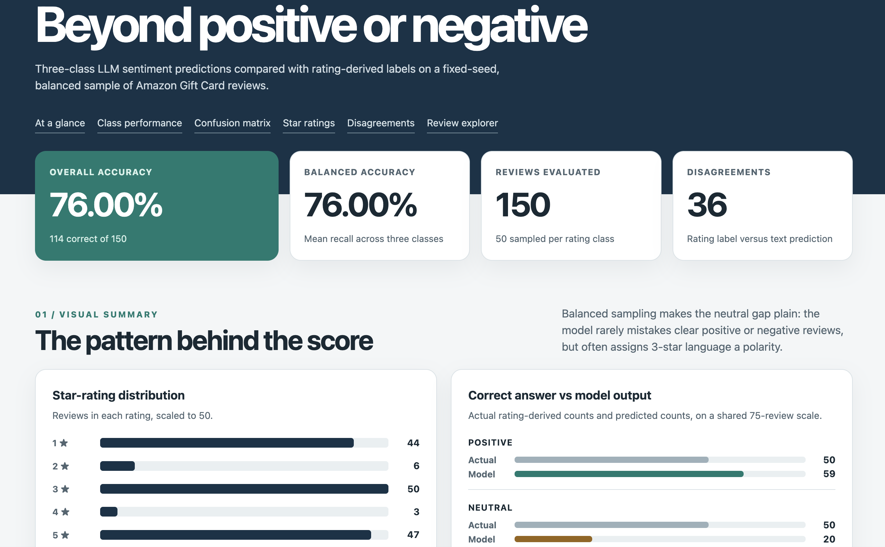

# Amazon Gift Card reviews: sentiment and emotion

MBAX 6418 · Reproducible, offline evaluation of text-only model predictions against labels derived from review ratings.

> **Submission review:** This report was drafted with an AI agent from the saved CSV files. I will check the figures and put the conclusions in my own words before submitting it.



Open the [interactive dashboard](dashboard/index.html) by downloading the repository and opening `dashboard/index.html` in a browser. It is a self-contained HTML file with all 150 balanced-run reviews embedded; no server or network connection is needed.

## Data and method

The source is the **Gift_Cards review category** from [McAuley Lab's Amazon Reviews '23 dataset](https://amazon-reviews-2023.github.io/). The [dataset card](https://huggingface.co/datasets/McAuley-Lab/Amazon-Reviews-2023) identifies the category, and the original [Gift_Cards review download](https://datarepo.eng.ucsd.edu/mcauley_group/data/amazon_2023/raw/review_categories/Gift_Cards.jsonl.gz) supplies the JSON Lines file. Download and decompress it to `data/Gift_Cards.jsonl`; the large, re-downloadable corpus is excluded from Git. The NRC word list must also be obtained separately from the [NRC Emotion Lexicon page](https://www.saifmohammad.com/WebPages/NRC-Emotion-Lexicon.htm); its terms do not permit redistribution here.

The model receives **only each review's title and text**. Ratings, rating-derived labels, previous predictions, and NRC scores stay outside the request. The [current three-class prompt](PROMPTS.md) asks for JSON with sentiment and one of eight primary emotions. Locally, 4–5 stars map to POSITIVE, 3 to NEUTRAL, and 1–2 to NEGATIVE. The balanced run samples 50 reviews per class from the full file with fixed seed `6418`, retains source row IDs, and saves every completed prediction so interrupted runs can resume.

## What changed when the sample was balanced?

The original first-100 run was **93 POSITIVE and 7 NEGATIVE** under the earlier binary rule, which put 3-star reviews in NEGATIVE. It got **98/100 correct (98.00%)**; positive recall was **92/93 (98.92%)**, negative recall **6/7 (85.71%)**, and balanced accuracy **92.32%**. Most of its test cases were positive, so raw accuracy gave little information about how the model would handle a substantial number of neutral and negative reviews.

The saved, seeded three-class run is **50 POSITIVE, 50 NEUTRAL, and 50 NEGATIVE**. It got **114/150 correct (76.00%)**; balanced accuracy is also **76.00%** because the classes are equal-sized. Recall is **48/50 (96.00%)** for POSITIVE, **18/50 (36.00%)** for NEUTRAL, and **48/50 (96.00%)** for NEGATIVE. The lower score reflects both a different sample and a harder *three-class* task; it should not be attributed to balancing alone. Its key finding is that neutral language often gets forced toward a polarity.

| Rating-derived class → model class | POSITIVE | NEUTRAL | NEGATIVE |
|---|---:|---:|---:|
| POSITIVE | **48** | 2 | 0 |
| NEUTRAL (3 stars) | 9 | **18** | 23 |
| NEGATIVE | 2 | 0 | **48** |

Of the **50** actual 3-star reviews, the model labeled **23 NEGATIVE**, **9 POSITIVE**, and only **18 NEUTRAL**. Thus 3-star reviews have their own answer-key class but usually collapse into a sentiment inferred from the words, especially NEGATIVE. The reverse error—an actual negative called neutral—did not occur in this run. The model's predicted totals were **59 POSITIVE, 20 NEUTRAL, 71 NEGATIVE**. The first-100 binary matrix was 92 true positives, 6 true negatives, 1 false positive, and 1 false negative; it could not expose this neutral-class weakness.

## Two primary-emotion methods

The separate saved [first-100 emotion output](outputs/predictions_with_emotions.csv) compares the LLM's primary emotion with an independent NRC word-list score. Each title and review text is normalized and tokenized; the script counts associations for anger, anticipation, disgust, fear, joy, sadness, surprise, and trust. A fixed priority resolves highest-score ties and records the tied emotions. Zero-score reviews are marked `NO_MATCH` and excluded from agreement rather than treated as disagreements.

The methods were comparable on **85/100** reviews. They agreed on **20/85 (23.53%)** and disagreed on **65/85**; the other **15** had no NRC match. The LLM most often chose **JOY (93/100)**, while the word list most often chose **ANTICIPATION (59/100)**, then **JOY (21/100)**. The leading disagreement was **LLM JOY → NRC ANTICIPATION (55 reviews)**. In **47** of those 55, NRC's top score was tied, so the deterministic priority put ANTICIPATION ahead of JOY. There were **52 NRC ties** overall. This is primarily a method difference: a word list counts isolated tokens and cannot reliably interpret context, negation, terse praise, or which feeling dominates an entire purchase experience. A tie winner is a reproducible rule, not a decisive emotion finding. These figures describe the historical first-100 sample, not the later balanced sample.

## Issues and checks

- The initial binary rule treated 3 stars as NEGATIVE. A short, positively worded 3-star review therefore looked like an error even when the model read its wording sensibly. The three-class run gives those reviews a distinct NEUTRAL answer key.
- The original file order overrepresented positive reviews. Fixed-seed class sampling from the full file exposed neutral confusion while preserving a reproducible set of source rows.
- Thin chart segments could collapse visually. The dashboard prints counts alongside bars, gives tracks explicit width, and audits that nonzero segments have visible pixels. Explorer filter counts are checked against the embedded records.
- Model calls can fail. The scoring script flushes each completed row and validates saved rows before resuming; invalid model JSON is rejected rather than counted as a prediction.

I checked the report's matrices and percentages against the committed CSV outputs, and the dashboard's embedded rows and chart values against the balanced CSV. The offline tests also verify filtering and that the dashboard makes no external requests. These are text-to-rating comparisons, not independently hand-labeled sentiment judgments; mixed reviews can reasonably disagree with a star-derived label.

## Working files and reproduction

| Deliverable | File |
|---|---|
| Current and historical prompts | [`PROMPTS.md`](PROMPTS.md); executable definitions in [`giftcard_reviews/sentiment.py`](giftcard_reviews/sentiment.py) |
| Balanced scoring script | [`giftcard_reviews/balanced_evaluation.py`](giftcard_reviews/balanced_evaluation.py) |
| NRC word-list scorer and emotion comparison | [`giftcard_reviews/nrc_emotion.py`](giftcard_reviews/nrc_emotion.py), [`giftcard_reviews/emotion_evaluation.py`](giftcard_reviews/emotion_evaluation.py) |
| Dashboard generator | [`scripts/build_balanced_dashboard.py`](scripts/build_balanced_dashboard.py) |
| Balanced run's raw output | [`outputs/balanced_three_class.csv`](outputs/balanced_three_class.csv) |
| Final offline dashboard | [`dashboard/index.html`](dashboard/index.html) |
| Earlier first-100 outputs | [`outputs/predictions.csv`](outputs/predictions.csv), [`outputs/predictions_with_emotions.csv`](outputs/predictions_with_emotions.csv) |

From the project folder, using Python 3.9+ and Node.js for the JavaScript filter check:

```bash
python3 -m giftcard_reviews.balanced_evaluation
python3 scripts/build_balanced_dashboard.py
python3 scripts/verify_dashboard.py
node scripts/verify_dashboard_filters.mjs
python3 -m unittest discover -s tests -v
```

The evaluation command reuses the committed balanced output if the same source file is present; it does not call the model again for completed rows. To create a fresh experiment, use a different `--output` path. It uses the course OpenAI-compatible endpoint and model defined in `giftcard_reviews/sentiment.py`, with `GIFT_CARD_API_KEY` as an optional override. To reproduce the earlier NRC comparison from scratch, run `python3 -m giftcard_reviews.emotion_evaluation --lexicon /path/to/NRC-Emotion-Lexicon-Wordlevel-v0.92.txt`. The current dashboard is generated solely from the saved balanced CSV.
